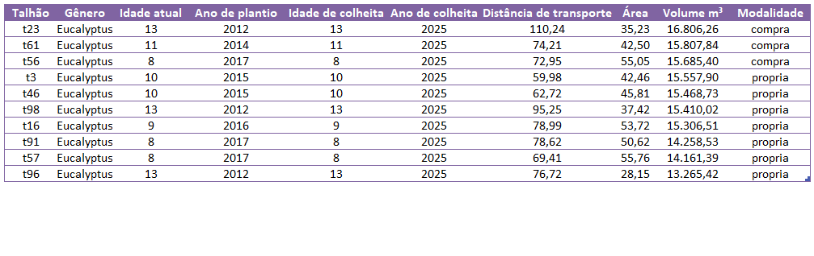

## Passo a passo para usar o app

1.  Prepare seu arquivo Excel conforme o modelo abaixo.
2.  Suba o arquivo `.xlsx` usando o botão "Browse.." da aba "Upload do arquivo".
3.  Verifique na pré-visualização se a sequência das informações estão corretas no seu documento de input.

### Modelo aceito

-   A planilha deve conter estas informações sequencialmente:
   
  | `ID Talhão` | `Gênero` | `Idade atual (anos)` | `Ano de plantio` | `Idade de colheita (anos)` | `Ano de colheita` | `Distância de transporte até a fábrica (km)` | | `Área (ha)` | `Volume (m³)` | `Modalidade` | 

------------------------------------------------------------------------

❕Ns nomes das colunas não precisam ser idênticos aos do exemplo, contanto que as informações correspondam.

### Exemplo de uma fração de tabela:

